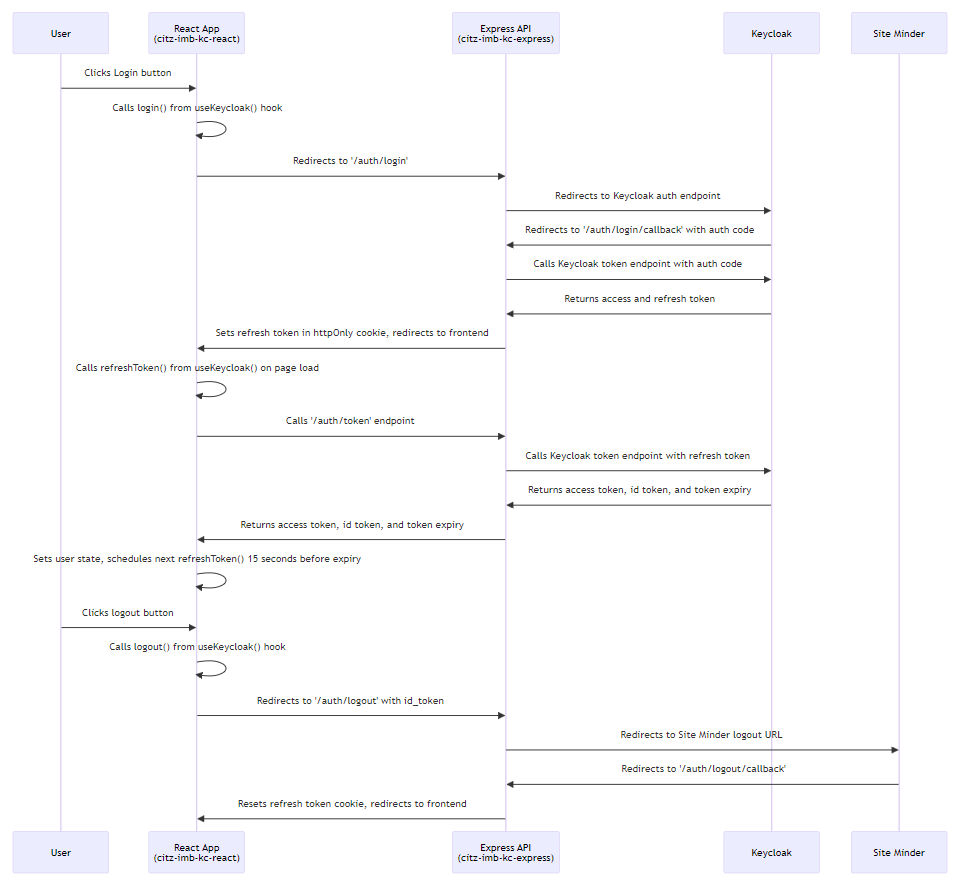

# BCGov SSO Keycloak Integration for Express

[](Redirect-URL)
[](LICENSE)


[](NodeJS)
[](Typescript)
[](Express)

<br />

<details>
<summary><h2>TL/DR</h2></summary>

1. Install package by following the steps at [Installing the Package](#installing-the-package).
2. Set up the package by following the steps at [Basic Setup Guide](#basic-setup-guide).
3. For use with [@bcgov/citz-imb-kc-react].

</details>

---

## Table of Contents

- [General Information](#general-information)
- [Installing the Package](#installing-the-package) - **Start Here!**
- [Basic Setup Guide](#basic-setup-guide) - Setting up after installing.
- [Environment Variables](#environment-variables) - Required variables for initialization.
- [Directory Structure](#directory-structure) - How the repo is designed.
- [Scripts](#scripts) - Scripts for running and working on the package.
- [Module Exports](#module-exports) - Functions and Types available from the module.
- [TypeScript Types](#typescript-types) - Available TypeScript types.
- [Initialization Options](#initialization-options) - Additional options.
- [Authentication on an Endpoint](#authentication-on-an-endpoint) - Require user to be signed in.
- [Authorization on an Endpoint](#authorization-on-an-endpoint) - Require user to have a role/permission.
- [Authentication Flow](#authentication-flow) - How it works.
- [Applications using Keycloak Solution](#applications-using-keycloak-solution) - See an example of how to use.

## General Information

- For running on a NodeJS:20 Express API.
- For Keycloak Gold Standard.
- Works with Vanilla JavaScript or Typescript 5.
- For use with [@bcgov/citz-imb-kc-react]
- Test

---

<br />

## Installing the Package

1. Add the following line to your `package.json`:

``` JSON5
{
  "dependencies": {
    "@bcgov/citz-imb-kc-express": "https://github.com/bcgov/citz-imb-kc-express/releases/download/v<VERSION>/bcgov-citz-imb-kc-express-<VERSION>.tgz",
    // The rest of your dependencies...
  },
}
```

2. Replace `<VERSION>` with the version you wish to use. Reference [releases] for version numbers.

<br />

3. Run `npm install` to add the package.

[Return to Top](#bcgov-sso-keycloak-integration-for-express)

<br />

## Basic Setup Guide

1. Add import `const { keycloak } = require('@bcgov/citz-imb-kc-express');` or `import { keycloak } from '@bcgov/citz-imb-kc-express';` to the top of the file that defines the express app. Add `keycloak(app);` below the definition of the express app, where `app` is defined by `express()`.

*Example:*

```JavaScript
import express, { Application } from 'express';
import { keycloak } from '@bcgov/citz-imb-kc-express';

// Define Express App
const app = express();

// Initialize Keycloak(app: Application, options?: KCOptions).
keycloak(app);
```

2. Add the required environment variables from the [Environment Variables](#environment-variables) section below.

[Return to Top](#bcgov-sso-keycloak-integration-for-express)

<br />

## Environment Variables

```ENV
# Ensure the following environment variables are defined on the container.

FRONTEND_URL= # URL of the frontend application.
BACKEND_URL= # URL of the backend application.

SSO_CLIENT_ID= # Keycloak client_id
SSO_CLIENT_SECRET= # Keycloak client_secret
SSO_AUTH_SERVER_URL= # Keycloak auth URL, see example below.
# https://dev.loginproxy.gov.bc.ca/auth/realms/standard/protocol/openid-connect

DEBUG= # (optional) Set to 'true' to get useful debug statements in api console.
VERBOSE_DEBUG= # (optional) Set to 'true' to get extra details from DEBUG.
SM_LOGOUT_URI= # (optional) Site minder logout url, see default value below.
# https://logontest7.gov.bc.ca/clp-cgi/logoff.cgi
```

[Return to Top](#bcgov-sso-keycloak-integration-for-express)

<br />

## Directory Structure

```
.
├── .github/
|   ├── config/
|   |   └── dep-report.json5                # Configure options for NPM Dep Report.
|   ├── helpers/
|   |   ├── github-api/                     # Functions to access the GitHub API.
|   |   ├── create-npm-dep-report-issues.js # Creates GitHub Issues for Npm Dep Reports.
|   |   ├── create-npm-dep-report.js        # Creates text bodies for Npm Dep Reports.
|   |   ├── parse-json5-config.js           # Parses json5 files for GitHub actions output.
|   |   └── parse-npm-deps.js               # Parses package.json files for changes to package versions.
|   ├── workflows/
|   |   ├── npm-dep-report.yaml             # Reports on new package versions.
|   |   └── releases.yaml                   # Creates a new GitHub Release.
├── .husky/
|   └── post-commit                         # Script that runs after a git commit.
├── scripts/
|   ├── bump-version.mjs                    # Bumps version in package.json file.
|   ├── post-commit-version-change.mjs      # Bumps version when post-commit is run.
|   ├── remove-dts-files.mjs                # Removes TypeScript declaration files from the build.
|   └── remove-empty-dirs.mjs               # Removes empty directories from the build.
├── src/                                    # Source code for package.
|   ├── utils/                              # Utility functions.
|   ├── config.ts                           # Config variables.
|   ├── controllers.ts                      # Controllers such as login and logout.
|   ├── index.ts                            # Export functions for the package.
|   ├── middleware.ts                       # Protected route middleware.
|   ├── router.ts                           # Router for routes such as login and token.
|   └── types.ts                            # TypeScript types.
├── package.json                            # Package config and dependencies.
├── .npmrc                                  # NPM config.
├── rollup.config.mjs                       # Builds and compiles TypeScript files into JavaScript.
├── rollupdts.config.mjs                    # Builds and compiles TypeScript declartion files.
```

[Return to Top](#bcgov-sso-keycloak-integration-for-express)

<br />

## Scripts

```bash
# Compile all src code into a bundle in build/ directory.
$ npm run build
```

```bash
# Part of 'build' and it bundles the typescipt declarations into a single bundle.d.ts file.
$ npm run build:dts
```

```bash
# Part of build and it removes directories and files before the build.
$ npm run clean:prebuild
```

```bash
# Part of build and it removes directories and files after the build.
$ npm run clean:postbuild
```

```bash
# Used to package the code before a release.
$ npm run pack
```

[Return to Top](#bcgov-sso-keycloak-integration-for-express)

<br />

## Module Exports

These are the functions and types exported by the `@bcgov/citz-imb-kc-express` module.

```JavaScript
import {
  keycloak, // Initializes the keycloak service in your express app.
  protectedRoute, // Middleware function used for authentication and authorization.
  hasRole, // Utility function used to return a boolean if user has specified roles.
} from '@bcgov/citz-imb-kc-express';

// TypeScript Types:
import {
  KeycloakUser, // Base type for req.user
  KeycloakIdirUser, // User types specific to Idir users.
  KeycloakBCeIDUser, // User types specific to BCeID users.
  KeycloakGithubUser, // User types specific to Github users.
  KCOptions, // Type of optional second parameter for keycloak()
  ProtectedRouteOptions, // Type of optional second parameter for protectedRoute()
  HasRoleOptions, // Type of optional third parameter for hasRole()
  IdentityProvider, // Combined type for identity providers.
  IdirIdentityProvider, // Used for more efficient login.
  BceidIdentityProvider, // Used for more efficient login.
  GithubIdentityProvider, // Used for more efficient login.
} from '@bcgov/citz-imb-kc-express';

```

[Return to Top](#bcgov-sso-keycloak-integration-for-express)

<br />

## TypeScript Types

These are the TypeScript types of the `@bcgov/citz-imb-kc-express` module.

```TypeScript
const keycloak: (app: Application, options?: KCOptions) => void;
const protectedRoute: (roles?: string[], options?: ProtectedRouteOptions) => RequestHandler;
const hasRole = (
  user: KeycloakUser,
  roles: string[],
  options?: HasRoleOptions
) => boolean;

export type IdirIdentityProvider = "idir";
export type BceidIdentityProvider =
  | "bceidbasic"
  | "bceidbusiness"
  | "bceidboth";
export type GithubIdentityProvider = "githubbcgov" | "githubpublic";

export type IdentityProvider = IdirIdentityProvider &
  BceidIdentityProvider &
  GithubIdentityProvider;

export type BaseKeycloakUser = {
  name?: string;
  preferred_username: string;
  email: string;
  display_name: string;
  client_roles?: string[];
  scope?: string;
  identity_provider:
    | IdirIdentityProvider
    | BceidIdentityProvider
    | GithubIdentityProvider;
};

export type KeycloakIdirUser = {
  idir_user_guid?: string;
  idir_username?: string;
  given_name?: string;
  family_name?: string;
};

export type KeycloakBCeIDUser = {
  bceid_user_guid?: string;
  bceid_username?: string;
  bceid_business_name?: string;
};

export type KeycloakGithubUser = {
  github_id?: string;
  github_username?: string;
  orgs?: string;
  given_name?: string;
  family_name?: string;
  first_name?: string;
  last_name?: string;
};

export type KeycloakUser = BaseKeycloakUser &
  KeycloakIdirUser &
  KeycloakBCeIDUser &
  KeycloakGithubUser;

export type KCOptions = {
  afterUserLogin?: (userInfo: KeycloakUser) => Promise<void> | void;
  afterUserLogout?: (userInfo: KeycloakUser) => Promise<void> | void;
};

export type ProtectedRouteOptions = {
  requireAllRoles?: boolean;
};

export type HasRoleOptions = {
  requireAllRoles?: boolean;
};
```

[Return to Top](#bcgov-sso-keycloak-integration-for-express)

<br />

## Initialization Options

Optional second parameter to the `keycloak()` function.  
Use cases may include adding user to database upon first login or updating a last login field.

*Example:*

```JavaScript
import { KCOptions, KeycloakUser, keycloak } from "@bcgov/citz-imb-kc-express";

const KEYCLOAK_OPTIONS: KCOptions = {
  afterUserLogin: (user: KeycloakUser) => {
    if (user) activateUser(user);
  },
  afterUserLogout: (user: KeycloakUser) => {
    console.log(`${user?.display_name ?? "Unknown"} has logged out.`);
  },
};

// Initialize keycloak:
keycloak(app, KEYCLOAK_OPTIONS);
```

[Return to Top](#bcgov-sso-keycloak-integration-for-express)

<br />

## Authentication on an Endpoint

Require keycloak authentication before using an endpoint.
Import `protectedRoute` from `@bcgov/citz-imb-kc-express` and add as middleware.

```JavaScript
import { protectedRoute } from '@bcgov/citz-imb-kc-express';

// Use in file where express app is defined:
app.use("/users", protectedRoute(), usersRouter);

// OR use in router:
import express from "express";
const router = express.Router();

router.get("/", exampleController());
router.get("/protected", protectedRoute(), exampleProtectedController());
```

<br />

> [!Important]  
> The following **WILL NOT WORK**:

```JavaScript
import { protectedRoute } from '@bcgov/citz-imb-kc-express';

// THIS WILL NOT WORK.
app.use("/api", protectedRoute(), guestRouter);
app.use("/api", protectedRoute(['admin']), adminRouter);
```

[Return to Top](#bcgov-sso-keycloak-integration-for-express)

<br />

## Authorization on an Endpoint

The first way of authorization on an endpoint is by adding the required roles to the `protectedRoute()` middleware that was introduced above.

```Javascript
// Users must have 'Member' role.
app.use("/post", protectedRoute(['Member']), postRouter);

// Users must have BOTH 'Member' and 'Commenter' roles.
// requireAllRoles option is true by default.
app.use("/comment", protectedRoute(['Member', 'Commenter']), commentRouter);

// Users must have EITHER 'Member' or 'Verified' role.
app.use("/vote", protectedRoute(['Member', 'Verified'], { requireAllRoles: false }), voteRouter);
```

<br />

> [!Important]  
> The following **WILL NOT WORK** (see above section for router usage and workaround):

```JavaScript
import { protectedRoute } from '@bcgov/citz-imb-kc-express';

// THIS WILL NOT WORK.
app.use("/api", protectedRoute(), guestRouter);
app.use("/api", protectedRoute(['admin']), adminRouter);
```

<br />

Here is how to get the keycloak user info **in a protected endpoint**.  

> [!IMPORTANT] 
> `req.user.client_roles` property is either a populated array or undefined. It is recommended to use the `hasRole()` function instead of checking `req.user.client_roles`.

Example within a controller of a protected route:

Add import `import { hasRole } from '@bcgov/citz-imb-kc-express'` if using `hasRole()` function.

Use case could be first protecting the route so only users with the `Admin, Member, Commenter, OR Verified` roles can use the endpoint, and then doing something different based on role/permission.

```JavaScript
const user = req?.user;

// Do something with users full name.
const userFullname = `${user.given_name} ${user.family_name}`;

// User must have 'Admin' role.
if (hasRole(user, ['Admin'])) // Do something...

// Users must have BOTH 'Member' and 'Commenter' roles.
// requireAllRoles option is true by default.
if (hasRole(user, ['Member', 'Commenter'])) // Do something...

// Users must have EITHER 'Member' or 'Verified' role.
if (hasRole(user, ['Member', 'Verified'], { requireAllRoles: false })) // Do Something...
```

For all user properties reference [SSO Keycloak Wiki - Identity Provider Attribute Mapping].  
Example IDIR `req.user` object (Typescript Type is `KeycloakUser & KeycloakIdirUser`):

```JSON
{
  "idir_user_guid": "W7802F34D2390EFA9E7JK15923770279",
  "identity_provider": "idir",
  "idir_username": "JOHNDOE",
  "name": "Doe, John CITZ:EX",
  "preferred_username": "a7254c34i2755fea9e7ed15918356158@idir",
  "given_name": "John",
  "display_name": "Doe, John CITZ:EX",
  "family_name": "Doe",
  "email": "john.doe@gov.bc.ca",
  "client_roles": ["Admin"]
}
```

[Return to Top](#bcgov-sso-keycloak-integration-for-express)

<br />

## Authentication Flow



[Return to Top](#bcgov-sso-keycloak-integration-for-express)

<br />

## Applications using Keycloak Solution

The following applications are currently using this keycloak implementation solution:

[SET](https://github.com/bcgov/citz-imb-salary-estimate-tool) - Salary Estimation Tool
[PIMS](https://github.com/bcgov/PIMS) - Property Inventory Management System (experimenting in express-api directory)
[PLAY](https://github.com/bcgov/citz-imb-playground) - CITZ IMB Package Testing App

[Return to Top](#bcgov-sso-keycloak-integration-for-express)

<!-- Link References -->

[@bcgov/citz-imb-kc-react]: https://github.com/bcgov/citz-imb-kc-react
[releases]: https://github.com/bcgov/citz-imb-kc-express/releases
[SSO Keycloak Wiki - Identity Provider Attribute Mapping]: https://github.com/bcgov/sso-keycloak/wiki/Identity-Provider-Attribute-Mapping
